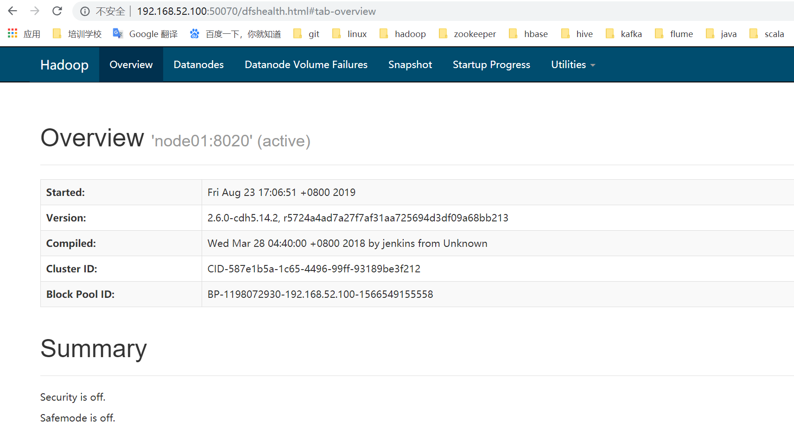

# 搭建hadoop环境

## 虚拟机与linux版本

* VirtualBox
* centos7.6 64位版本
种子文件下载地址：http://mirrors.aliyun.com/centos/7.6.1810/isos/x86_64/CentOS-7-x86_64-DVD-1810.torrent

## linux服务器环境准备

root用户修改名字： hostnamectl set-hostname node01

修改ip地址：

```
vi /etc/sysconfig/network-scripts/ifcfg-ens33 

BOOTPROTO="static"
IPADDR=192.168.52.100
NETMASK=255.255.255.0
GATEWAY=192.168.52.2
DNS1=8.8.8.8
```

使用service network restart命令，重启网络服务。


准备三台linux机器，IP地址分别设置成为

第一台机器IP地址：192.168.52.100

第二台机器IP地址：192.168.52.110

第三台机器IP地址：192.168.52.120

使用service network restart命令，重启网络服务。


准备三台linux机器，IP地址分别设置成为

第一台机器IP地址：192.168.52.100

第二台机器IP地址：192.168.52.110

第三台机器IP地址：192.168.52.120

### 三台机器关闭防火墙

三台机器在root用户下执行以下命令关闭防火墙

```
systemctl disable firewalld.service
```

### 三台机器关闭selinux

三台机器在root用户下执行以下命令关闭selinux

三台机器执行以下命令，关闭selinux

```
vim /etc/selinux/config 

SELINUX=disabled
```

### 三台机器更改主机名

三台机器分别更改主机名

第一台主机名更改为：node01

第二台主机名更改为：node02

第三台主机名更改为：node03


第一台机器执行以下命令修改主机名

```
vim /etc/hostname
node01
```

### 三台机器更改主机名与IP地址映射

三台机器执行以下命令更改主机名与IP地址映射关系

```
vim /etc/hosts

192.168.52.100  node01
192.168.52.110  node02
192.168.52.120  node03
```

### 添加普通用户

添加普通用户hadoop，并给以sudo权限，用于以后所有的大数据软件的安装

并统一设置普通用户的密码为  123456

```
 useradd hadoop
 passwd hadoop
```

为普通用户添加sudo权限

```
visudo

hadoop  ALL=(ALL)       ALL
```


### 安装jdk

上传压缩包到第一台服务器的/kkb/soft下面，然后进行解压，配置环境变量即可

```
cd /kkb/soft/

tar -zxf jdk-8u181-linux-x64.tar.gz  -C /kkb/install/
sudo vim /etc/profile


#添加以下配置内容，配置jdk环境变量
export JAVA_HOME=/kkb/install/jdk1.8.0_141
export PATH=:$JAVA_HOME/bin:$PATH
```

source /etc/profile
 java -version
问题 ：
Linux下环境变量配置错误 导致大部分命令不可以使用的解决办法
直接解决方法：在命令行中输入：export PATH=/usr/bin:/usr/sbin:/bin:/sbin:/usr/X11R6/bin 后 Enter

## 安装hadoop

### 创建hadoop用户组和hadoop用户

```shell
#1.创建用户组hadoop
[root@node01 ~]# groupadd hadoop
#2.创建用户hadoop并添加到hadoop用户组中
[root@node01 ~]# useradd -g hadoop hadoop
#3.使用id命令查看hadoop用户组和hadoop用户创建是否成功
[root@node01 ~]# id hadoop
#用户uid 			用户组id gid      用户组名
uid=1000(hadoop) gid=1000(hadoop) groups=1000(hadoop)
#设置hadoop用户密码为hadoop
[root@node01 ~]# passwd hadoop
Changing password for user hadoop.
New password: #输入hadoop后回车
BAD PASSWORD: The password is shorter than 8 characters
Retype new password: #再次输入hadoop后回车
passwd: all authentication tokens updated successfully.
```

### 安装目录

定义linux服务器软件压缩包存放目录，以及解压后安装目录，三台机器执行以下命令，创建两个文件夹，一个用于存放软件压缩包目录，一个用于存放解压后目录

```java
 mkdir -p /kkb/soft     # 软件压缩包存放目录
 mkdir -p /kkb/install  # 软件解压后存放目录
 chown -R hadoop:hadoop /kkb    # 将文件夹权限更改为hadoop用户
```

### 安装和配置hadoop

下载CDH发型版的hadoop

[下载地址](http://archive.cloudera.com/cdh5/cdh/5/hadoop-2.6.0-cdh5.14.2.tar.gz)

### 上传hadoop安装包,进行解压

```shell
#解压安装包到/kkb/install目录下
[root@node01 ~]# tar -xzvf hadoop-2.6.0-cdh5.14.2.tar.gz -C /kkb/install
```

### 配置hadoop环境变量

1.配置环境变量

```shell
#1.在linux系统全局配置文件的末尾进行hadoop和java的环境变量配置
[root@node1 ~]# vi /etc/profile
[root@node01 ~]# vi /etc/profile
# /etc/profile

# System wide environment and startup programs, for login setup
# Functions and aliases go in /etc/bashrc

# It's NOT a good idea to change this file unless you know what you
# are doing. It's much better to create a custom.sh shell script in
# /etc/profile.d/ to make custom changes to your environment, as this
# will prevent the need for merging in future updates.

pathmunge () {
    case ":${PATH}:" in
        *:"$1":*)
            ;;
        *)
            if [ "$2" = "after" ] ; then
                PATH=$PATH:$1
            else
                PATH=$1:$PATH
            fi
    esac
}
"/etc/profile" 85L, 2028C

for i in /etc/profile.d/*.sh /etc/profile.d/sh.local ; do
    if [ -r "$i" ]; then
        if [ "${-#*i}" != "$-" ]; then
            . "$i"
        else
            . "$i" >/dev/null
        fi
    fi
done

unset i
unset -f pathmunge

JAVA_HOME=/kkb/install/jdk1.8.0_141
HADOOP_HOME=/kkb/install/hadoop-2.6.0-cdh5.14.2

PATH=$PATH:$HOME/bin:$JAVA_HOME/bin:$HADOOP_HOME/bin:$HADOOP_HOME/sbin

export JAVA_HOME
export HADOOP_HOME
export PATH                                                                                                                                                                                                     
:wq!
```


2.验证环境变量

```shell
#1.使环境变量生效
[root@node1 ~]# source .bash_profile 
#2.显示hadoop的版本信息
[root@node1 ~]# hadoop version
#3.显示出hadoop版本信息表示安装和环境变量成功.
Hadoop 3.1.2
Source code repository https://github.com/apache/hadoop.git -r 1019dde65bcf12e05ef48ac71e84550d589e5d9a
Compiled by sunilg on 2019-01-29T01:39Z
Compiled with protoc 2.5.0
From source with checksum 64b8bdd4ca6e77cce75a93eb09ab2a9
This command was run using /opt/bigdata/hadoop-3.1.2/share/hadoop/common/hadoop-common-3.1.2.jar
[root@node1 ~]# 
```

**hadoop用户下也需要按照root用户配置环境变量的方式操作一下**

### 配置hadoop-env.sh

这个文件只需要配置JAVA_HOME的值即可,在文件中找到export JAVA_HOME字眼的位置，删除最前面的#

```shell
export JAVA_HOME=/kkb/install/jdk1.8.0_141
```

```shell
[root@node1 ~]#cd /kkb/install/hadoop-2.6.0-cdh5.14.2/etc/hadoop
You have new mail in /var/spool/mail/root
[root@node1 hadoop]# pwd
/opt/bigdata/hadoop-3.1.2/etc/hadoop
[root@node1 hadoop]# vi hadoop-env.sh 
```

### 配置core-site.xml

切换到/kkb/install/hadoop-2.6.0-cdh5.14.2/etc/hadoop目录下

```shell
[root@node1 ~]# cd /kkb/install/hadoop-2.6.0-cdh5.14.2/etc/hadoop
```

```xml

<configuration>
	<property>
		<name>fs.defaultFS</name>
		<value>hdfs://node01:8020</value>
	</property>
	<property>
		<name>hadoop.tmp.dir</name>
		<value>/kkb/install/hadoop-2.6.0-cdh5.14.2/hadoopDatas/tempDatas</value>
	</property>
	<!--  缓冲区大小，实际工作中根据服务器性能动态调整 -->
	<property>
		<name>io.file.buffer.size</name>
		<value>4096</value>
	</property>
<property>
     <name>fs.trash.interval</name>
     <value>10080</value>
     <description>检查点被删除后的分钟数。 如果为零，垃圾桶功能将被禁用。 
     该选项可以在服务器和客户端上配置。 如果垃圾箱被禁用服务器端，则检查客户端配置。 
     如果在服务器端启用垃圾箱，则会使用服务器上配置的值，并忽略客户端配置值。</description>
</property>

<property>
     <name>fs.trash.checkpoint.interval</name>
     <value>0</value>
     <description>垃圾检查点之间的分钟数。 应该小于或等于fs.trash.interval。 
     如果为零，则将该值设置为fs.trash.interval的值。 每次检查指针运行时，
     它都会从当前创建一个新的检查点，并删除比fs.trash.interval更早创建的检查点。</description>
</property>
</configuration>
```

### 配置hdfs-site.xml

配置/kkb/install/hadoop-2.6.0-cdh5.14.2/etc/hadoop目录下的hdfs-site.xml

```xml
<configuration>
	<!-- NameNode存储元数据信息的路径，实际工作中，一般先确定磁盘的挂载目录，然后多个目录用，进行分割   --> 
	<!--   集群动态上下线 
	<property>
		<name>dfs.hosts</name>
		<value>/kkb/install/hadoop-2.6.0-cdh5.14.2/etc/hadoop/accept_host</value>
	</property>
	
	<property>
		<name>dfs.hosts.exclude</name>
		<value>/kkb/install/hadoop-2.6.0-cdh5.14.2/etc/hadoop/deny_host</value>
	</property>
	 -->
	 
	 <property>
			<name>dfs.namenode.secondary.http-address</name>
			<value>node01:50090</value>
	</property>

	<property>
		<name>dfs.namenode.http-address</name>
		<value>node01:50070</value>
	</property>
	<property>
		<name>dfs.namenode.name.dir</name>
		<value>file:///kkb/install/hadoop-2.6.0-cdh5.14.2/hadoopDatas/namenodeDatas</value>
	</property>
	<!--  定义dataNode数据存储的节点位置，实际工作中，一般先确定磁盘的挂载目录，然后多个目录用，进行分割  -->
	<property>
		<name>dfs.datanode.data.dir</name>
		<value>file:///kkb/install/hadoop-2.6.0-cdh5.14.2/hadoopDatas/datanodeDatas</value>
	</property>
	
	<property>
		<name>dfs.namenode.edits.dir</name>
		<value>file:///kkb/install/hadoop-2.6.0-cdh5.14.2/hadoopDatas/dfs/nn/edits</value>
	</property>
	<property>
		<name>dfs.namenode.checkpoint.dir</name>
		<value>file:///kkb/install/hadoop-2.6.0-cdh5.14.2/hadoopDatas/dfs/snn/name</value>
	</property>
	<property>
		<name>dfs.namenode.checkpoint.edits.dir</name>
		<value>file:///kkb/install/hadoop-2.6.0-cdh5.14.2/hadoopDatas/dfs/nn/snn/edits</value>
	</property>
	<property>
		<name>dfs.replication</name>
		<value>3</value>
	</property>
	<property>
		<name>dfs.permissions</name>
		<value>false</value>
	</property>
	<property>
		<name>dfs.blocksize</name>
		<value>134217728</value>
	</property>
</configuration>
```

### 配置mapred-site.xml

```shell
#默认没有mapred-site.xml文件,这里需要从模板中复制一份出来进行修改配置
[root@node01 hadoop]# cp  mapred-site.xml.template mapred-site.xml
```

配置/kkb/install/hadoop-2.6.0-cdh5.14.2/etc/hadoop目录下的mapred-site.xml

```xml
<!--指定运行mapreduce的环境是yarn -->
<configuration>
   <property>
		<name>mapreduce.framework.name</name>
		<value>yarn</value>
	</property>

	<property>
		<name>mapreduce.job.ubertask.enable</name>
		<value>true</value>
	</property>
	
	<property>
		<name>mapreduce.jobhistory.address</name>
		<value>node01:10020</value>
	</property>

	<property>
		<name>mapreduce.jobhistory.webapp.address</name>
		<value>node01:19888</value>
	</property>
</configuration>
```


### 配置yarn-site.xml

配置/kkb/install/hadoop-2.6.0-cdh5.14.2/etc/hadoop目录下的yarn-site.xml

```xml
<configuration>
	<property>
		<name>yarn.resourcemanager.hostname</name>
		<value>node01</value>
	</property>
	<property>
		<name>yarn.nodemanager.aux-services</name>
		<value>mapreduce_shuffle</value>
	</property>

	
	<property>
		<name>yarn.log-aggregation-enable</name>
		<value>true</value>
	</property>


	<property>
		 <name>yarn.log.server.url</name>
		 <value>http://node01:19888/jobhistory/logs</value>
	</property>

	<!--多长时间聚合删除一次日志 此处-->
	<property>
        <name>yarn.log-aggregation.retain-seconds</name>
        <value>2592000</value><!--30 day-->
	</property>
	<!--时间在几秒钟内保留用户日志。只适用于如果日志聚合是禁用的-->
	<property>
        <name>yarn.nodemanager.log.retain-seconds</name>
        <value>604800</value><!--7 day-->
	</property>
	<!--指定文件压缩类型用于压缩汇总日志-->
	<property>
        <name>yarn.nodemanager.log-aggregation.compression-type</name>
        <value>gz</value>
	</property>
	<!-- nodemanager本地文件存储目录-->
	<property>
        <name>yarn.nodemanager.local-dirs</name>
        <value>/kkb/install/hadoop-2.6.0-cdh5.14.2/hadoopDatas/yarn/local</value>
	</property>
	<!-- resourceManager  保存最大的任务完成个数 -->
	<property>
        <name>yarn.resourcemanager.max-completed-applications</name>
        <value>1000</value>
	</property>

</configuration>
```

### 编辑slaves

此文件用于配置集群有多少个数据节点,我们把node2，node3作为数据节点,node1作为集群管理节点.

配置/kkb/install/hadoop-2.6.0-cdh5.14.2/etc/hadoop目录下的slaves

```shell
[root@node1 hadoop]# vi slaves 
#将localhost这一行删除掉
node01
node02
node03
~                          
```

### 创建文件存放目录

node01机器上面创建以下目录

```shell
[root@node01 ~]# mkdir -p /kkb/install/hadoop-2.6.0-cdh5.14.2/hadoopDatas/tempDatas
mkdir -p /kkb/install/hadoop-2.6.0-cdh5.14.2/hadoopDatas/namenodeDatas
[root@node01 ~]# mkdir -p /kkb/install/hadoop-2.6.0-cdh5.14.2/hadoopDatas/namenodeDatas
[root@node01 ~]# mkdir -p /kkb/install/hadoop-2.6.0-cdh5.14.2/hadoopDatas/datanodeDatas
[root@node01 ~]# mkdir -p /kkb/install/hadoop-2.6.0-cdh5.14.2/hadoopDatas/dfs/nn/edits
[root@node01 ~]# mkdir -p /kkb/install/hadoop-2.6.0-cdh5.14.2/hadoopDatas/dfs/snn/name
[root@node01 ~]# mkdir -p /kkb/install/hadoop-2.6.0-cdh5.14.2/hadoopDatas/dfs/nn/snn/edits
[root@node01 ~]# 
```

### 使集群所有机器环境变量生效

```shell
[root@node01 ~]# source /etc/profile
[root@node01 ~]# hadoop version
#显示hadoop的版本为cdh版本，说明环境变量配置成功
Hadoop 2.6.0-cdh5.14.2
Subversion http://github.com/cloudera/hadoop -r 5724a4ad7a27f7af31aa725694d3df09a68bb213
Compiled by jenkins on 2018-03-27T20:40Z
Compiled with protoc 2.5.0
From source with checksum 302899e86485742c090f626a828b28
This command was run using /kkb/install/hadoop-2.6.0-cdh5.14.2/share/hadoop/common/hadoop-common-2.6.0-cdh5.14.2.jar
[root@node01 ~]# 
```

## 修改hadoop安装目录的权限

node01,node02，node03安装目录的权限

node01节点操作

```shell
#1.修改目录所属用户和组为hadoop:hadoop
[root@node01 ~]# chown -R hadoop:hadoop /kkb
[root@node01 ~]# 

#2.修改目录所属用户和组的权限值为755
[root@node01 ~]# chmod -R 755  /kkb
[root@node01 ~]# 
```

## VirtualBox 克隆两台虚拟机

命名为node02, node03

## hadoop用户免密码登录

三台机器在hadoop用户下执行以下命令生成公钥与私钥比

```
ssh-keygen -t rsa 
三台机器在hadoop用户下，执行以下命令将公钥拷贝到node01服务器上面去
ssh-copy-id  node01
node01在hadoop用户下，执行以下命令，将authorized_keys拷贝到node02与node03服务器
cd /home/hadoop/.ssh/
scp authorized_keys  node02:$PWD
scp authorized_keys  node03:$PWD
```

## 格式化hadoop

```shell
#切换
[root@node01 ~]# su - hadoop
[hadoop@node01 hadoop]$  hdfs namenode -format
[hadoop@node01 ~]$ hdfs namenode -format
19/08/23 04:32:34 INFO namenode.NameNode: STARTUP_MSG: 
/************************************************************
STARTUP_MSG: Starting NameNode
STARTUP_MSG:   user = hadoop
STARTUP_MSG:   host = node01.kaikeba.com/192.168.52.100
STARTUP_MSG:   args = [-format]
STARTUP_MSG:   version = 2.6.0-cdh5.14.2
STARTUP_MSG:   classpath = /kkb/install/hadoop-2.6.0-19/08/23 04:32:35 INFO common.Storage: Storage directory /kkb/install/hadoop-2.6.0-
#显示格式化成功。。。
cdh5.14.2/hadoopDatas/namenodeDatas has been successfully formatted.
19/08/23 04:32:35 INFO common.Storage: Storage directory /kkb/install/hadoop-2.6.0-cdh5.14.2/hadoopDatas/dfs/nn/edits has been successfully formatted.
19/08/23 04:32:35 INFO namenode.FSImageFormatProtobuf: Saving image file /kkb/install/hadoop-2.6.0-cdh5.14.2/hadoopDatas/namenodeDatas/current/fsimage.ckpt_0000000000000000000 using no compression
19/08/23 04:32:35 INFO namenode.FSImageFormatProtobuf: Image file /kkb/install/hadoop-2.6.0-cdh5.14.2/hadoopDatas/namenodeDatas/current/fsimage.ckpt_0000000000000000000 of size 323 bytes saved in 0 seconds.
19/08/23 04:32:35 INFO namenode.NNStorageRetentionManager: Going to retain 1 images with txid >= 0
19/08/23 04:32:35 INFO util.ExitUtil: Exiting with status 0
19/08/23 04:32:35 INFO namenode.NameNode: SHUTDOWN_MSG: 
#此处省略部分日志
/************************************************************
SHUTDOWN_MSG: Shutting down NameNode at node01.kaikeba.com/192.168.52.100
************************************************************/
[hadoop@node01 ~]$ 
```

## 启动集群

```shell
[hadoop@node01 ~]$ start-all.sh 
This script is Deprecated. Instead use start-dfs.sh and start-yarn.sh
19/08/23 05:18:09 WARN util.NativeCodeLoader: Unable to load native-hadoop library for your platform... using builtin-java classes where applicable
Starting namenodes on [node01]
node01: starting namenode, logging to /kkb/install/hadoop-2.6.0-cdh5.14.2/logs/hadoop-hadoop-namenode-node01.kaikeba.com.out
node01: starting datanode, logging to /kkb/install/hadoop-2.6.0-cdh5.14.2/logs/hadoop-hadoop-datanode-node01.kaikeba.com.out
node03: starting datanode, logging to /kkb/install/hadoop-2.6.0-cdh5.14.2/logs/hadoop-hadoop-datanode-node03.kaikeba.com.out
node02: starting datanode, logging to /kkb/install/hadoop-2.6.0-cdh5.14.2/logs/hadoop-hadoop-datanode-node02.kaikeba.com.out
Starting secondary namenodes [node01]
node01: starting secondarynamenode, logging to /kkb/install/hadoop-2.6.0-cdh5.14.2/logs/hadoop-hadoop-secondarynamenode-node01.kaikeba.com.out
19/08/23 05:18:24 WARN util.NativeCodeLoader: Unable to load native-hadoop library for your platform... using builtin-java classes where applicable
starting yarn daemons
starting resourcemanager, logging to /kkb/install/hadoop-2.6.0-cdh5.14.2/logs/yarn-hadoop-resourcemanager-node01.kaikeba.com.out
node03: starting nodemanager, logging to /kkb/install/hadoop-2.6.0-cdh5.14.2/logs/yarn-hadoop-nodemanager-node03.kaikeba.com.out
node02: starting nodemanager, logging to /kkb/install/hadoop-2.6.0-cdh5.14.2/logs/yarn-hadoop-nodemanager-node02.kaikeba.com.out
node01: starting nodemanager, logging to /kkb/install/hadoop-2.6.0-cdh5.14.2/logs/yarn-hadoop-nodemanager-node01.kaikeba.com.out
[hadoop@node01 ~]$ 
```

在浏览器地址栏中输入<http://192.168.52.100:50070/dfshealth.html#tab-overview>查看namenode的web界面.




## 运行mapreduce程序

mapreduce程序(行话程为词频统计程序(中文名),英文名：wordcount)，就是统计一个文件中每一个单词出现的次数，也是我们学习大数据技术最基础，最简单的程序，入门必须要会要懂的第一个程序，其地位和java，php，c#，javascript等编程语言的第一个入门程序HelloWorld(在控制台打印“hello world！”等字样)程序一样，尤为重要,不同的是它们是单机应用程序，我们接下来要运行的程序(wordcount)是一个分布式运行的程序，是在一个大数据集群中运行的程序。**wordcount程序能够正常的运行成功，输入结果，意味着我们的大数据环境正确的安装和配置成功。**好，简单的先介绍到这里，接下来让我们爽一把吧。

```shell
#1.使用hdfs dfs -ls /  命令浏览hdfs文件系统，集群刚开始搭建好，由于没有任何目录所以什么都不显示.
[hadoop@node01 ~]$ hdfs dfs -ls /
#2.创建测试目录
[hadoop@node01 ~]$ hdfs dfs -mkdir /test 
#3.在此使用hdfs dfs -ls 发现我们刚才创建的test目录
[hadoop@node01 ~]$ hdfs dfs -ls /test
19/08/23 05:22:25 WARN util.NativeCodeLoader: Unable to load native-hadoop library for your platform... using builtin-java classes where applicable
Found 2 items
drwxr-xr-x   - hadoop supergroup          0 2019-08-23 05:21 /test/
[hadoop@node01 ~]$
#4.使用touch命令在linux本地目录创建一个words文件
[hadoop@node01 ~]$ touch words
#5.文件中输入如下内容
[hadoop@node01 ~]$ vi words
i love you
are you ok

#6.将创建的本地words文件上传到hdfs的test目录下
[hadoop@node01 ~]$ hdfs dfs -put words /test
#7.查看上传的文件是否成功
[hadoop@node01 ~]$ hdfs dfs -ls -r /test
Found 1 items
-rw-r--r--   3 hadoop supergroup         23 2019-06-30 17:28 /test/words
#/test/words 是hdfs上的文件存储路径 /test/output是mapreduce程序的输出路径，这个输出路径是不能已经存在的路径，mapreduce程序运行的过程中会自动创建输出路径，数据路径存在的话会报错，这里需要同学注意下.
[hadoop@node01 ~]$ hadoop jar /kkb/install/hadoop-2.6.0-cdh5.14.2/share/hadoop/mapreduce/hadoop-mapreduce-examples-2.6.0-cdh5.14.2.jar wordcount /test/words /test/output
19/08/23 05:21:22 WARN util.NativeCodeLoader: Unable to load native-hadoop library for your platform... using builtin-java classes where applicable
19/08/23 05:21:23 INFO client.RMProxy: Connecting to ResourceManager at node01/192.168.52.100:8032
19/08/23 05:21:23 INFO input.FileInputFormat: Total input paths to process : 1
19/08/23 05:21:23 INFO mapreduce.JobSubmitter: number of splits:1
19/08/23 05:21:24 INFO mapreduce.JobSubmitter: Submitting tokens for job: job_1566551905266_0001
19/08/23 05:21:24 INFO impl.YarnClientImpl: Submitted application application_1566551905266_0001
19/08/23 05:21:24 INFO mapreduce.Job: The url to track the job: http://node01:8088/proxy/application_1566551905266_0001/
19/08/23 05:21:24 INFO mapreduce.Job: Running job: job_1566551905266_0001
19/08/23 05:21:31 INFO mapreduce.Job: Job job_1566551905266_0001 running in uber mode : true
19/08/23 05:21:31 INFO mapreduce.Job:  map 100% reduce 0%
19/08/23 05:21:33 INFO mapreduce.Job:  map 100% reduce 100%
19/08/23 05:21:33 INFO mapreduce.Job: Job job_1566551905266_0001 completed successfully
19/08/23 05:21:33 INFO mapreduce.Job: Counters: 52
        File System Counters
                FILE: Number of bytes read=140
                FILE: Number of bytes written=226
                FILE: Number of read operations=0
                FILE: Number of large read operations=0
                FILE: Number of write operations=0
                HDFS: Number of bytes read=374
                HDFS: Number of bytes written=309275
                HDFS: Number of read operations=41
                HDFS: Number of large read operations=0
                HDFS: Number of write operations=18
        Job Counters 
                Launched map tasks=1
                Launched reduce tasks=1
                Other local map tasks=1
                Total time spent by all maps in occupied slots (ms)=0
                Total time spent by all reduces in occupied slots (ms)=0
                TOTAL_LAUNCHED_UBERTASKS=2
                NUM_UBER_SUBMAPS=1
                NUM_UBER_SUBREDUCES=1
                Total time spent by all map tasks (ms)=677
                Total time spent by all reduce tasks (ms)=1357
                Total vcore-milliseconds taken by all map tasks=0
                Total vcore-milliseconds taken by all reduce tasks=0
                Total megabyte-milliseconds taken by all map tasks=0
                Total megabyte-milliseconds taken by all reduce tasks=0
        Map-Reduce Framework
                Map input records=2
                Map output records=6
                Map output bytes=46
                Map output materialized bytes=54
                Input split bytes=94
                Combine input records=6
                Combine output records=5
                Reduce input groups=5
                Reduce shuffle bytes=54
                Reduce input records=5
                Reduce output records=5
                Spilled Records=10
                Shuffled Maps =1
                Failed Shuffles=0
                Merged Map outputs=1
                GC time elapsed (ms)=0
                CPU time spent (ms)=2210
                Physical memory (bytes) snapshot=774352896
                Virtual memory (bytes) snapshot=6196695040
                Total committed heap usage (bytes)=549453824
        Shuffle Errors
                BAD_ID=0
                CONNECTION=0
                IO_ERROR=0
                WRONG_LENGTH=0
                WRONG_MAP=0
                WRONG_REDUCE=0
        File Input Format Counters 
                Bytes Read=23
        File Output Format Counters 
                Bytes Written=28
[hadoop@node01 ~]$ 
```

## 停止集群

```
[hadoop@node1 ~]$ stop-all.sh
```


